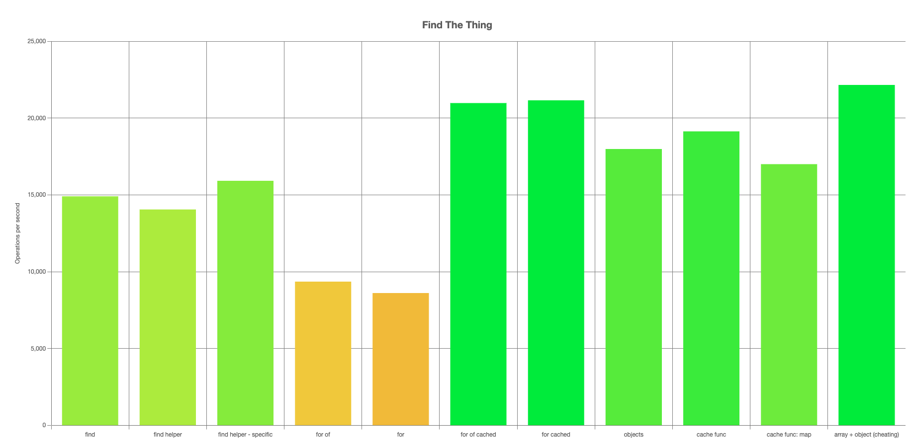

# Parent lookup by ID

Benchmark of different approaches to looking up a child object's parent by id.

i.e. your data looks something like this

```ts
interface Parent {
    id: number;
    name: string;
}

interface Child {
    id: number;
    name: string;
    parentId: Parent["id"];
}

interface State {
    parents: Parent[];
    children: Children[];
}
```

and you want to do something like this

```ts
for (const child of state.children) {
    const parent = state.parents.find((parent) => parent.id === child.parentId);
    console.log(`${child.name} is the child of ${parent.name}`);
}
```

## Installation

```
npm install
npm start
```

## Results

An HTML page of results is created at `./benchmark/results/bench.chart.html`



## Conclusion

`Array.find` is pretty good! If performance isn't an issue then it's worth sticking with. Writing a helper to throw an exception if an item isn't improves the ergonomics, and is worth taking the minor performance hit for. Strangely there is a small _positive_ impact of using a helper which takes the id explicitly (`find helper - specific`).

If performance does become an issue then caching clearly helps (`for of cached` / `for cached`). Using a factory function (`cache func`) brings the ergonomics on par with `find`, so is worth taking the small performance hit unless critical.

Storing everything as objects (`objects`) means having to call `Objects.values` whenever you need to loop, but does help prevent your collection from having two items with the same id. Performance is better than non-caching methods, so is worth considering. 

The theoretical best performance is having children in an array, and parents in an object (`array + object`); however this is only practical in situations where you rarely need to loop over the parents.
